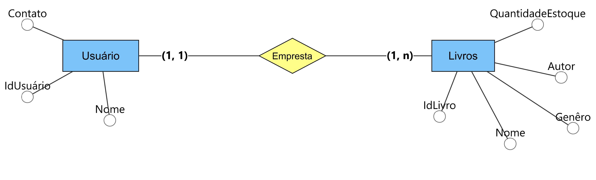

# Modelo Entidade-Relacionamento — Sistema de Biblioteca

**Curso:** Engenharia de Software
**Integrantes:**
- Nivea Sofia de Cas
- Yasmin Fernanda de Carvalho

---

## Diagrama

**Resumo:** o diagrama modela um sistema de biblioteca com as entidades **Usuário** (IdUsuário, Nome, Contato) e **Livros** (IdLivro, Nome, Autor, Genêro, QuantidadeEstoque), conectadas pelo relacionamento **Empresta**. A cardinalidade (1, 1) do lado de Usuário indica que cada empréstimo pertence a um único usuário; a cardinalidade (1, n) do lado de Livros indica que um empréstimo pode conter um ou mais livros.

---

## Diário de Bordo

| Data | Atividade realizada | Responsáveis |
|---|---|---|
| 11/08/2026 | Elaboração do diagrama Entidade-Relacionamento (ER) do sistema de biblioteca, definindo as entidades Usuário e Livros, seus atributos e o relacionamento Empresta com as respectivas cardinalidades. | Nivea Sofia de Cas, Yasmin Fernanda de Carvalho |

---

# Segurança do Banco de Dados

> Resumo de estudo e conceitos, ameaças e medidas de proteção

---

## O que é?

Um método para garantir a **confidencialidade dos dados**.

Quanto mais difícil o acesso e o uso ao banco de dados, mais seguro ele é, buscando restringir as permissões de usuários ao mínimo necessário.

---

## Qual a importância?

Projetos secretos ainda em desenvolvimento podem vazar, outras pessoas podem fazer uso indevido e a empresa pode nunca mais se erguer por conta disso.

> O vazamento de dados confidenciais tem um custo real, e que pode ser altíssimo.
> A empresa ainda deve arcar com custos para investigar as causas, além de poder ficar manchada e perder credibilidade.

---

## Quais são os pilares da segurança?

| Pilar | Descrição |
|---|---|
| Dados | Os dados armazenados no banco de dados |
| DBMS | O sistema de gerenciamento do banco de dados |
| Aplicações | Quaisquer aplicações associadas |
| Servidor | Físico ou virtual, e o hardware subjacente |
| Infraestrutura | Rede usada para acessar o banco de dados |

---

## Principais ameaças à segurança do banco de dados

| Ameaça | O que é |
|---|---|
| **Vulnerabilidades de software** | Falhas em softwares de gerenciamento exploradas por hackers — manter sistemas sempre atualizados |
| **Injeção SQL/NoSQL** | Comandos maliciosos inseridos em aplicações para acessar ou alterar dados |
| **Estouro de buffer** | Um programa tenta armazenar mais dados do que a memória permite |
| **Malware** | Programas maliciosos que exploram vulnerabilidades e causam danos |
| **Ataques a backups** | Cópias de segurança também precisam ser protegidas |
| **Ataques DoS** | Sobrecarregam o servidor, impedindo o acesso de usuários legítimos |

> O aumento da quantidade de dados, a expansão das infraestruturas de tecnologia e as exigências de segurança tornam a proteção dos bancos de dados cada vez mais importante.

---

## Principais medidas de segurança do banco de dados

A segurança do banco de dados deve proteger não apenas o banco em si, mas também a rede, os servidores, as aplicações e os dispositivos que possuem acesso a ele.

- **Segurança física** — manter os servidores em locais seguros e adequados.
- **Controle de acesso** — permitir que somente usuários autorizados tenham acesso e limitar suas permissões ao necessário.
- **Segurança de usuários e dispositivos** — monitorar quem acessa os dados e proteger os dispositivos utilizados.
- **Criptografia** — proteger os dados armazenados e durante a transmissão, incluindo informações de acesso.
- **Segurança do software** — manter o sistema de gerenciamento do banco atualizado e instalar os patches de segurança.
- **Segurança de aplicações e servidores** — proteger e testar aplicações que se conectam ao banco de dados.
- **Segurança dos backups** — proteger cópias de segurança com o mesmo nível de proteção do banco original.
- **Auditoria** — registrar acessos e operações realizadas com dados importantes, além de realizar verificações de segurança regularmente.

---

## O que é criptografia?

Uma forma de transformar um texto legível em algo ilegível.

É embaralhar as informações contidas, de forma que apenas quem possui a chave para desembaralhar as informações consiga entender.

---

## Como o controle de acessos afeta a modelagem?

Determinadas tratativas de segurança devem ser tomadas, de modo que se deve:

- Impedir e monitorar tentativas de acesso de quem **não** possui autorização para acessar determinado conteúdo.
- Facilitar o acesso de quem precisa/deve acessar aquela informação.

---

Resumo de estudo — Segurança de Banco de Dados
